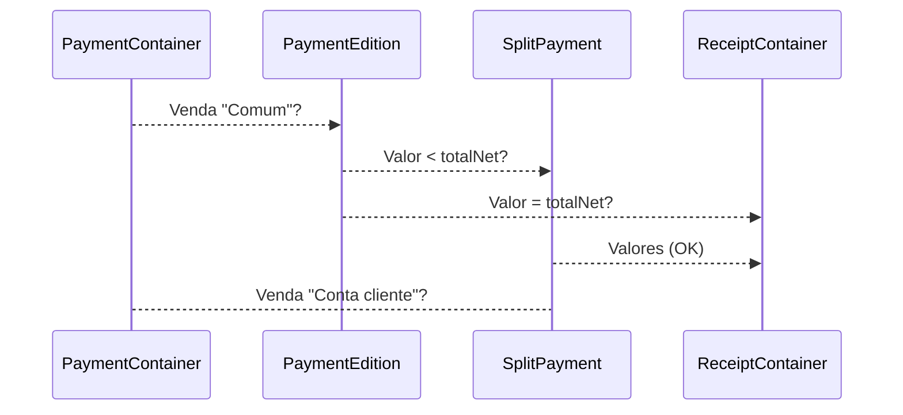

## Customer Account (Sale)

### Descrição:

Processo de gerar movimentações, (Debitar/Creditar) saldo na conta do cliente. 

### Fluxo Pagamento: 



### Rotas:

* CustomerDetail
* CustomerAccountEdit
* CustomerAccountBalance
* CustomerAccountFilter

### Serviços:

- KyteCustomersStatements
- KyteCustomerAccountEdit
- KyteCustomerAccountStatements

### Arquivos:

### ```CustomerContainer.js CustomerAccount.js (novo) CustomerAccountEdit.js (novo) CustomerAccountBalance.js (novo) CustomerStatements.js (novo) StatementItem.js (novo) CustomerNav.js models/customer.js models.js CustomerActions.js CustomersReducer.js Router.js Calculator.js CenteredContent.js (novo) FilterLabel.js (novo) KyteText.js (novo)```


<hr />
#### CustomerContainer.js

> **path:** src/components/customers/CustomerContainer.js*
>
> **route:** *CustomerStack > CustomersList*

**Descrição:** Lorem ipsum dolor sit amet, consectetur adipiscing elit. Ut a diam venenatis, malesuada dolor id.

**Alterações:**

> **goToCustomer:** *Morbi sagittis justo cursus mattis pellentesque. Nulla ac aliquam tortor, eget placerat enim. In hac habitasse platea dictumst. Sed viverra turpis nulla:*

```javascript
function goToCustomer() {
 const { navigation, customer, newProp } = this.props;
  
 navigation.navigate('CustomerDetail', { customer: { ...customer, newProp } });
 // Adicionado nova propriedade ao usuário
} 
```
<br>
**Novas Props**:

| Propriedade      | Origem                                                 |
| ---------------- | ------------------------------------------------------ |
| ```newProp```    | ```Realm: models/customer.js > CustomerReducer.js```   |
| ```secondProp``` | ```Serviço: KyteAccountInitializer > AuthReducer.js``` |


<hr />
#### CustomerDetail.js

> **path:** src/components/customers/customer/CustomerDetail.js*
>
> **route:** *CustomerStack > CustomerSave*

**Descrição:** Lorem ipsum dolor sit amet, consectetur adipiscing elit. Ut a diam venenatis, malesuada dolor id.

**Alterações:**

> **state:** *Adicionado nova rota para as tabs:*

```javascript
const routes = [
  { key: '3', title: I18n.t('customerTabDataLabel').toUpperCase() }
]
 // Adicionada nova ao this.state
```

<br>

> **renderTabs:** *Adicionado nova tab com o component <CustomerWallet />:*

```javascript
function renderTabs = SceneMap({
  3: () => <CustomerWallet navigation={this.props.navigation} />,
});
 // Adicionada nova tab
```

**Novas Props**:

| Propriedade   | Origem                                               |
| ------------- | ---------------------------------------------------- |
| ```newProp``` | ```Realm: models/customer.js > CustomerReducer.js``` |


<hr />
#### CustomerWallet.js

> **path:** src/components/customers/customer/CustomerWallet.js*
>
> **route:** *CustomerStack > CustomerSave*

**Descrição:** Lorem ipsum dolor sit amet, consectetur adipiscing elit. Ut a diam venenatis, malesuada dolor id.

**Pricipais métodos:**

> **fetchWallet:** *Função que consome o serviço com o histórico da carteira do cliente:*

```javascript
function fetchWallet() {
  this.props.fetchCustomerWallet();
}
```

<br>

> **userWalletAddValue:** *Método para adicionar valor a carteira do usuário, os valores da carteira vindos do model customer são geridos pelo reducer* ``` manageUserWallet: { value: 100, credit: 20, debit: 5 } ``` 

```javascript
function userWalletAddValue() {
  const { value, credit } = this.props.manageUserWallet;
  
  this.props.CustomerWalletAddValue(value, credit);
}
 // Adicionada crédito a carteira do usuário
```
<br>

> **userWalletRemoveValue:** *Método para remove valor a carteira do usuário, os valores da carteira vindos do model customer são geridos pelo reducer* ``` manageUserWallet: { value: 100, credit: 20, debit: 5 } ``` 

```javascript
function userWalletRemoveValue() {
  const { value, debit } = this.props.manageUserWallet;
  
  this.props.CustomerWalletAddValue(value, debit);
}
 // Remove crédito a carteira do usuário
```
<br>

**Props**:

| Propriedade          | Origem                                                |
| -------------------- | ----------------------------------------------------- |
| ```newProp```        | ```Realm: models/customer.js > CustomerReducer.js```  |
| ``manageUserWallet`` | ```Reducer: CustomerReducer.js > manageUserWaller ``` |

**Actions**:

| Action                          | Origem                                                    |
| ------------------------------- | --------------------------------------------------------- |
| ```fetchCustomerWallet```       | ```Serviço: KyteUserWalletHistory > customerActions.js``` |
| ```CustomerWalletAddValue```    | ```Serviço: KyteUserWalletAdd > customerActions.js```     |
| ```CustomerWalletRemoveValue``` | ```Serviço: KyteUserWalletRemove > customerActions.js```  |

